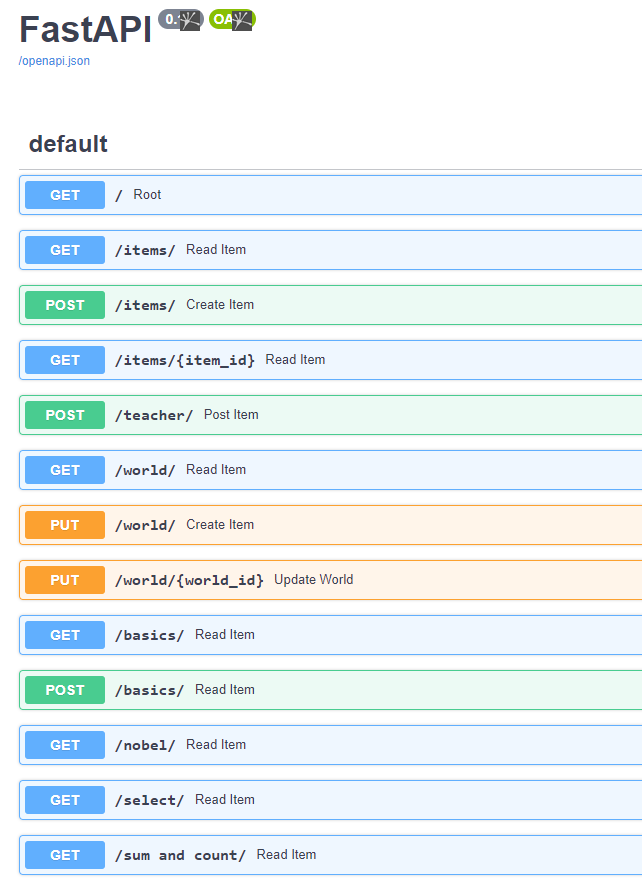
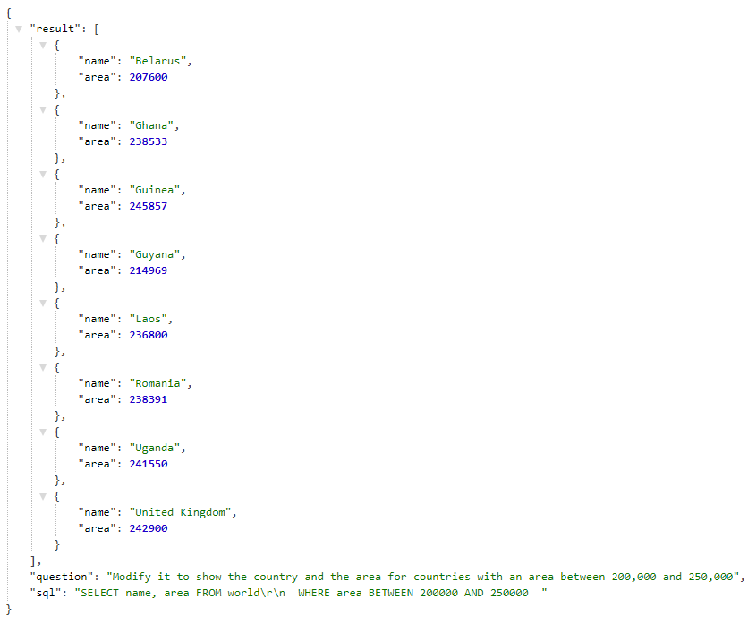
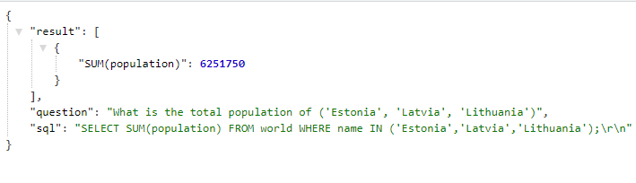
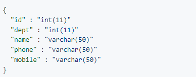
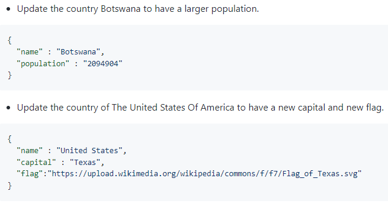

## Assignment 4 - SqlZoo Answers & Data files

### Loic Konan

#### Description

- Created a local database of the SqlZoo data using the data files located at the following address: **<https://cs.msutexas.edu/~griffin/data/SqlZoo/>**
- Created Queries to answer each of the questions from this website **<https://sqlzoo.net>**
- **Example:**
>
>
> - **<http://192.81.216.230:8001/docs/>**
>  
> 
>
> - **GET Routes:**
> - **Route:** http://Your.IP.Address:8001/basics/3
> 
> 
> - **Route:** http://Your.IP.Address:8001/sum_and_count/5
> 
>
> - **POST Routes:**
> - Insert a new row into the teachers table.
> - **Route:** http://Your.IP.Address:8001/teacher/
> 
>
> - **PUT Routes:**
> - Update the world table.
> - **Route:** <http://Your.IP.Address:8001/world/>
>  
>
>
### Files

|   #   | File                               | Description                                     | Status                  |
| :---: | ---------------------------------- | ----------------------------------------------- | ----------------------- |
|   1   | [Sql_Zoo_Answers](Sql_Zoo_Answers) | The answers for the SqlZoo website              | :ballot_box_with_check: |
|   2   | [main.py](main.py)                 | Main Python file to help connect to my database | :ballot_box_with_check: |
|   3   | [main2.py](main2.py)               | Python file to help connect to my database      | :ballot_box_with_check: |
|   4   | [mysqlCnx.py](mysqlCnx.py)         | The mysql connection file                       | :ballot_box_with_check: |

### References

|   #   | File                                                                                                   | Description               | Status                  |
| :---: | ------------------------------------------------------------------------------------------------------ | ------------------------- | ----------------------- |
|   1   | [https://realpython.com/python-mysql](https://realpython.com/python-mysql)                             | python-mysql              | :ballot_box_with_check: |
|   2   | [https://realpython.com/fastapi-python-web-apis](https://realpython.com/fastapi-python-web-apis)       | fastapi-python            | :ballot_box_with_check: |
|   3   | [https://realpython.com/api-integration-in-python/](https://realpython.com/api-integration-in-python/) | api-integration-in-python | :ballot_box_with_check: |
|   4   | [https://realpython.com/python-encodings-guide/](https://realpython.com/python-encodings-guide/)       | python-encodings-guide    | :ballot_box_with_check: |
