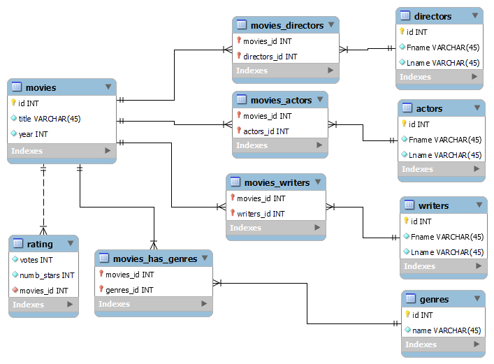

## Assignment 5 -  Movies DB

### Loic Konan

#### Description

> Created a local database of the movie data using the files located at the following address: <https://datasets.imdbws.com/>.
>
> - Retrieved all files.
> - Uncompressed the files.
> - Processed each file into a usable format.
> - Re-Organized the files by filtering / combining them to fit a schema.
>
> - Routes: <http://192.81.216.230:8002/>

### Files

|   #   | File                       | Description                                     | Status                  |
| :---: | -------------------------- | ----------------------------------------------- | ----------------------- |
|   1   | [main.py](main.py)         | Main Python file to help connect to my database | :ballot_box_with_check: |
|   2   | [mysqlCnx.py](mysqlCnx.py) | The mysql connection file                       | :ballot_box_with_check: |

### Schema

> 

### References

|   #   | File                                                                                                   | Description               | Status                  |
| :---: | ------------------------------------------------------------------------------------------------------ | ------------------------- | ----------------------- |
|   1   | [https://realpython.com/python-mysql](https://realpython.com/python-mysql)                             | python-mysql              | :ballot_box_with_check: |
|   2   | [https://realpython.com/fastapi-python-web-apis](https://realpython.com/fastapi-python-web-apis)       | fastapi-python            | :ballot_box_with_check: |
|   3   | [https://realpython.com/api-integration-in-python/](https://realpython.com/api-integration-in-python/) | api-integration-in-python | :ballot_box_with_check: |
|   4   | [https://realpython.com/python-encodings-guide/](https://realpython.com/python-encodings-guide/)       | python-encodings-guide    | :ballot_box_with_check: |
|   4   | [https://datasets.imdbws.com/](https://datasets.imdbws.com/)                                           | datasets.imdbws           | :ballot_box_with_check: |
