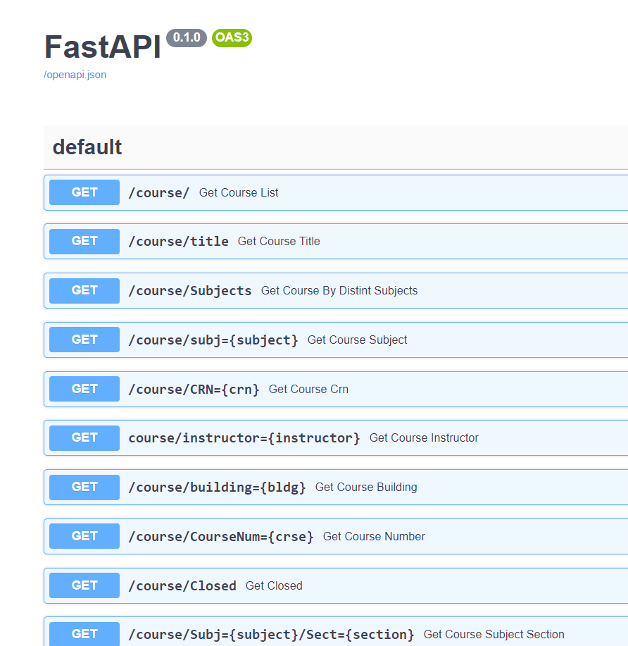
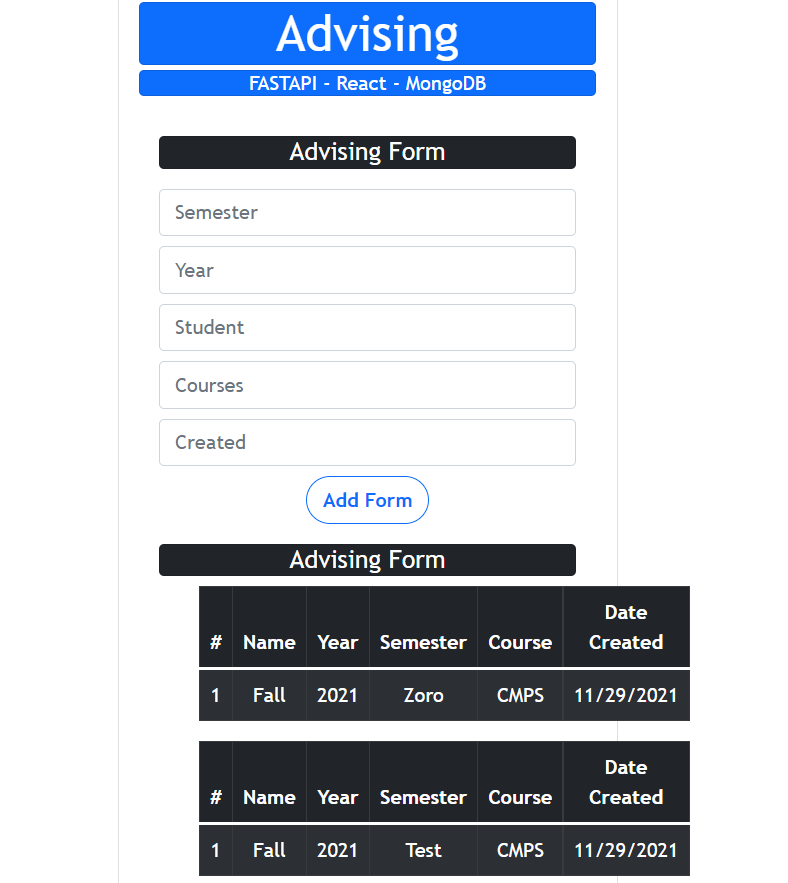

## Assignment 7 - Advising Project

### Loic Konan

#### Description
>
> - This project is a **full stack web with Javascript and Vuejs**.
> - This uses a **backend API and MongoDB as database**.
> - Ultimately the goal is to **"query" the schedule looking for courses that fit some search criteria**.
> - **Generate advising forms**.
>
>
> ### Course Info
>
> - Col: Abbreviation of College
> - Crn: Unique identifier for a course
> - Subj: Subject of course (CMPS, NURS, etc.)
> - Crse: Course number (4483, 1013, etc.)
> - Sect: Section number (101,200,10x,etc.),
> - Title: String title of course,
> - PrimaryInstructor: Professors name,
> - Max: Max enrollment (40, 30, etc.),
> - Curr: Current enrollment (integer <= Max),
> - Aval: Available seats (Max * Curr),
> - Days: Days offered (TR, MWF, MW,etc.),
> - Begin: Start time (1100am, 200pm, etc.),
> - End: End time (1220pm, etc.)
> - Bldg: Abbreviation for building (MY, FA, BO, etc.),
> - Room: Room number (136, 127A, etc.)
>
> ### Student Info
>
> - First Name
> - Last Name
> - M Number
> - Classification
> - Email
> - Gpa
> - Github username
>
> ### Advising Form Info
>
> - Semester
> - Year
> - Student
> - List of Courses
> - Date Created
>
> ## API
>
> This **Api** will run on **port 8004 the server**.
>
> - **<http://192.81.216.230:8004/>**
> 
>
> - ## Routes
>
> - **POST**
>   - Add course
>   - Add student
>   - Add advising form
>
> - **PUT**
>   - Edit Course
>   - Edit Student
>   - Edit Form
>
> - **GET**
>   - _**Student Based Routes**_
>     - Get list of students
>     - Get students by:
>       - Name
>       - M-Number
>       - Gpa (equal to or greater / less than)
>
> - **Course Based Routes**
>   - Find course(s) by:
>     - CRN (unique id)
>     - Subj (subject)
>     - Crse (course number)
>     - Instructor Name
>     - Bldg (building)
>
> - Find courses between Begin & End times
> - Find closed courses
> - Find courses with a partial title search
> - Find courses by Bldg (building) and Room
>
> - **Advising Forms**
>   - Find all advising forms
>   - Find form by student
>   - Find form by semester
>   - Find form by year
>   - Find form with any combination of above (student, semester, year)
> 
>

### Files

|   #   | File                   | Description  | Status                  |
| :---: | ---------------------- | ------------ | ----------------------- |
|   1   | [main.py](main.py)     | Helper code  | :ballot_box_with_check: |
|   2   | [schedules](schedules) | loading data | :ballot_box_with_check: |

### References

|   #   | File                                     | Description   | Status                  |
| :---: | ---------------------------------------- | ------------- | ----------------------- |
|   1   | [https://vuejs.org/](https://vuejs.org/) | Frontend Help | :ballot_box_with_check: |
