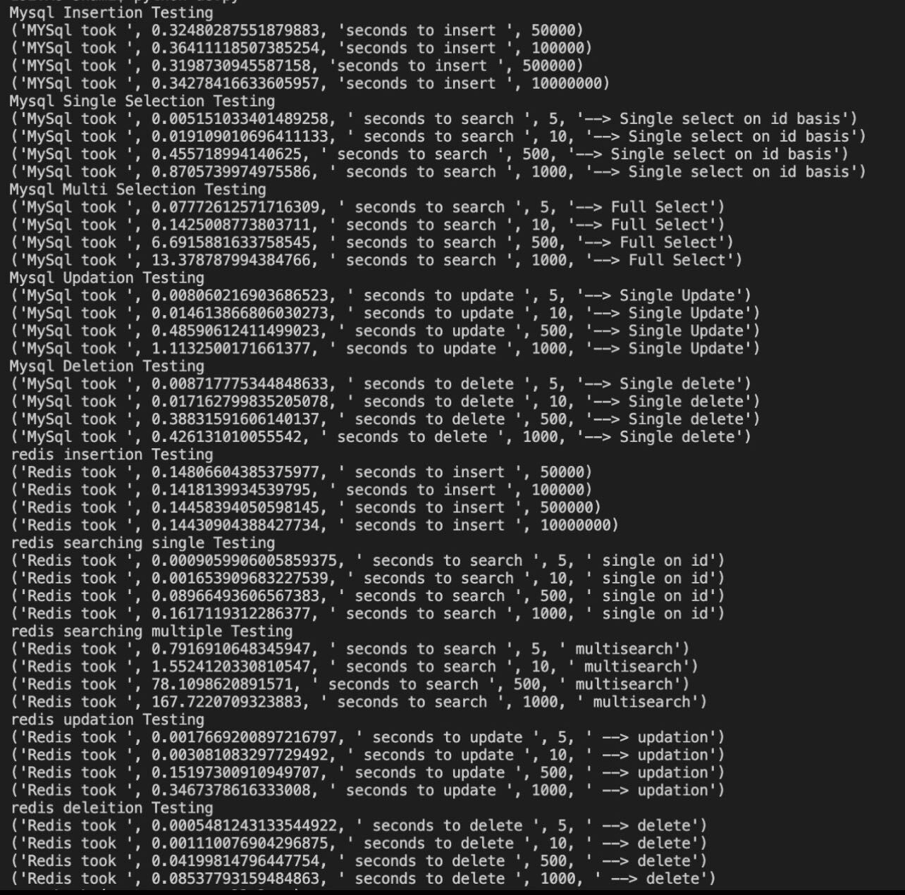
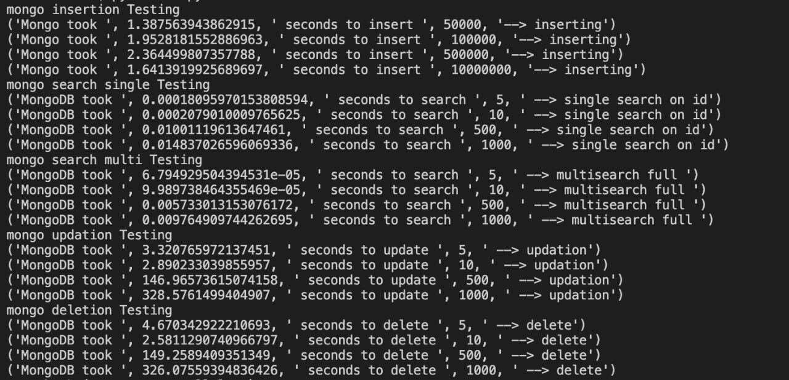

## Assignment 8 - Redis Project

### Loic Konan

#### Description

> The experiment should time each transaction and calculate averages.
> But each aggregation should be applied to a database that is configured with slight differences using the above variables.

- Insert N objects
- Do n searches for single values (comprised of strings, int's, etc.)
- Do n searches for multiple values
- Do n updates to existing documents (or tuples, or data structures)
- Do n deletes
You should vary N and n to determine whether each database performs differently not only under differing load types, but under different sizes as well. One possible approach could be:

- Set N, where N is number of items being inserted, to:
  - 50000
  - 100000
  - 500000
  - 1 Million
  - Possibly more depending on server specs
  
- Then using a percentage of N to determine how many transactions of different types to run, you can tailor the load on the database (document store, key value store). 
- For example you can increase or decrease specific transaction types for each experiment before moving onto the next transaction type:

- Run 1
  - Searches = .5 * N
  - Updates = 1.5 * N
  - Deletes = .25 * N
- Run 2
  - Searches = .75 * N
  - Updates = 1.5 * N
  - Deletes = .25 * N
- Run 3
  - Searches = 1 * N
  - Updates = 1.5 * N
  - Deletes = .25 * N
- Run N
  - etc.
By organizing the amounts for each transaction type before hand, you can structure your experiments and save results much easier.

However, this approach is feasible:

- Run X
  - Searches = random(0.25 , 3.0) * N
  - Updates = random(0.25 , 3.0)* N
  - Deletes = random(0.25 , 0.75) * N

> - 
> - 
>
>
>
>
### Files

|   #   | File                         | Description             | Status                  |
| :---: | ---------------------------- | ----------------------- | ----------------------- |
|   1   | [main.py](main.py)           | Helper code             | :ballot_box_with_check: |
|   2   | [get_data.php](get_data.php) | Helper to Load the data | :ballot_box_with_check: |
|   3   | [data](data)                 | Data Folder             | :ballot_box_with_check: |

### References

|   #   | File         | Description         | Status                  |
| :---: | ------------ | ------------------- | ----------------------- |
|   1   | [data](data) | Getting random data | :ballot_box_with_check: |