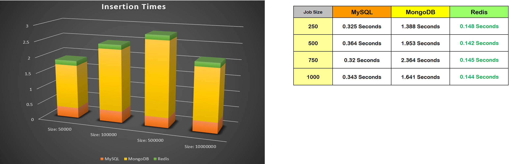
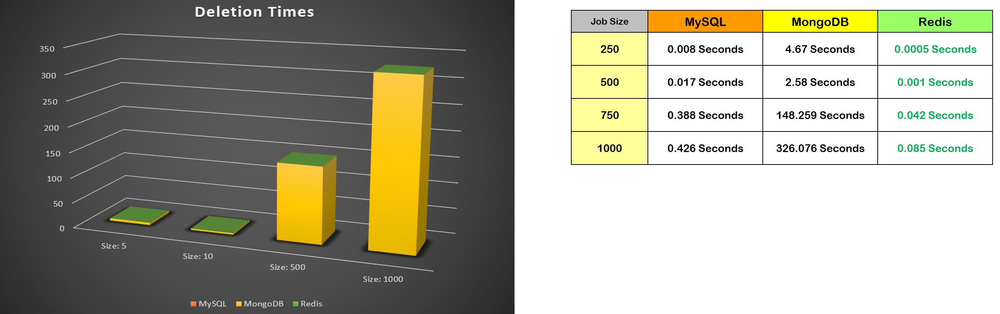
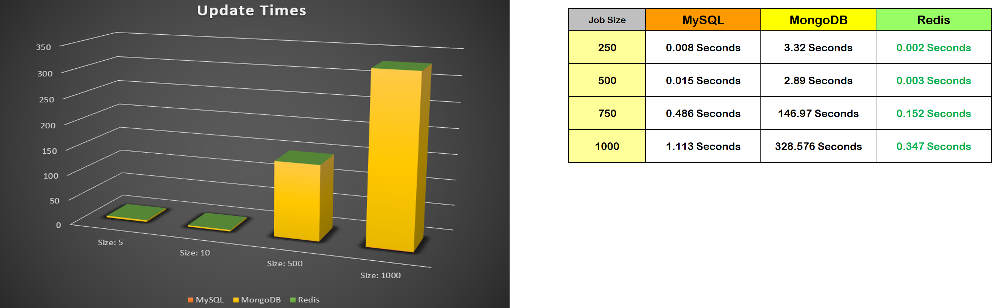

## Assignment 8 - Redis Project

### Loic Konan

#### Description

> - To compare and see the distinctions between **Redis and MongoDB and Mysql**.
> - This experiment should **time each transaction and calculate averages**.
> - each aggregation should be applied to a database that is configured with **slight differences**.
>
> - Do **n searches for single values**.
> - Do **n searches for multiple values**.
> - Do **n updates to existing documents**.
> - Do **n deletes**
>
> - One possible approach could be:
>   - **Set N, where N is number of items being inserted, to:**
>   - **50000**
>   - **100000**
>   - **500000**
>   - **1 Million**
>
  
>
> When **searching for a single values**:
>
> - **MongoDB** is faster with the _**lowest time**_.
> - **Redis** is the _**second fastest**_.
> - **MySql** come in **_last place_**.
> 
>
  
>
> When **searching for multiple values**:
>
> - **MySql** is _**faster**_ when the _**size of N is smaller**_.
> - **MongoDB** is the _**fastest**_ when the _**size of N get bigger**_.
> - **Redis** come in **_last place_**.
> 
>
  
>
> When **updating to existing documents**:
>
> - **Redis** is _**faster**_.
> - **MySql** is the _**second fastest**_.
> - **MongoDB** come in **_last place_**.
> 
>
  
>
> When Doing **N deletes:
>
> - **Redis** is faster with the _**lowest time**_.
> - **MySql** is the _**second fastest**_.
> - **MongoDB** come in **_last place_**.
> 
>
  
>
> When Doing **N update**:
>
> - **Redis** is faster with the _**lowest time**_.
> - **MySql** is the _**second fastest**_.
> - **MongoDB** come in **_last place_**.
> 
>
>  
>  

### Files

|   #   | File                         | Description             | Status                  |
| :---: | ---------------------------- | ----------------------- | ----------------------- |
|   1   | [main.py](main.py)           | Helper code             | :ballot_box_with_check: |
|   2   | [get_data.php](get_data.php) | Helper to Load the data | :ballot_box_with_check: |
|   3   | [data](data)                 | Data Folder             | :ballot_box_with_check: |

### References

|   #   | File         | Description         | Status                  |
| :---: | ------------ | ------------------- | ----------------------- |
|   1   | [data](data) | Getting random data | :ballot_box_with_check: |
